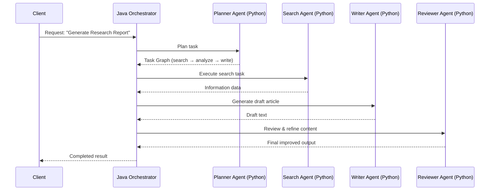
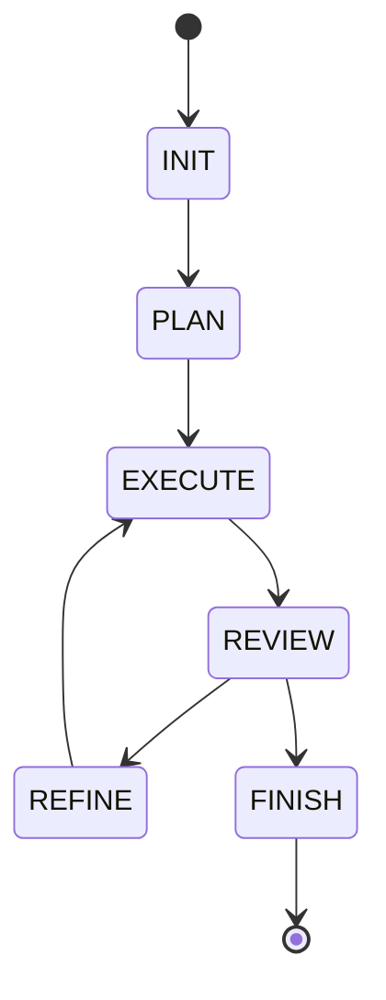

# 📘 Multi-Agent System with Java Orchestration + Python Workers
## Production Architecture • Technical Analysis • Full Implementation Blueprint

---

# 1. Giới thiệu dự án

Dự án **Multi-Agent System với Java Orchestrator + Python AI Workers** nhằm xây dựng một hệ thống có khả năng:

- Điều phối (orchestrate) nhiều tác nhân AI
- Mỗi agent đại diện một năng lực riêng (research, reasoning, RAG, writing…)
- Java đóng vai trò **não trung tâm**, đảm nhiệm orchestration & state machine
- Python xử lý **LLM reasoning**, gọi mô hình, thực thi tool
- Hệ thống hỗ trợ: task decomposition, agent cooperation, reflection loop, shared memory, retry logic, role-based routing

---

# 2. Mục tiêu tổng quan

Hệ thống Multi-Agent cần đạt:

- **Scalability**: thêm agent mới không phá vỡ kiến trúc
- **Observability**: trace đầy đủ flow agent-to-agent
- **Determinism**: logic AI được kiểm soát bằng Java, không phụ thuộc vào model
- **Extensibility**: mở rộng sang RAG, tool execution, multi-step reasoning
- **Production-ready**: logging, monitoring, HA, state management

---

# 3. Kiến trúc tổng thể

```
                          ┌─────────────────────────────┐
                          │  Client / Backend / Trigger │
                          └───────────────┬─────────────┘
                                          ▼
                          ┌─────────────────────────────┐
                          │   Java Orchestrator Layer   │
                          │  - Task Planner             │
                          │  - Agent Router             │
                          │  - Memory Manager           │
                          │  - State Machine Engine     │
                          └───────────────┬─────────────┘
              ┌───────────────────────────┼────────────────────────────┐
              ▼                           ▼                            ▼
     ┌────────────────┐          ┌────────────────┐           ┌───────────────────┐
     │ Python Worker  │          │ Python Worker  │           │ Python Worker     │
     │  AGENT A       │          │ AGENT B        │           │ AGENT C (RAG)     │
     │ Reasoning      │          │ Translation    │           │ Search + Answer   │
     └────────────────┘          └────────────────┘           └───────────────────┘
              └───────────────────────────┬────────────────────────────┘
                                          ▼
                          ┌─────────────────────────────┐
                          │ Shared Memory Store (Redis, │
                          │ VectorDB, Postgres, etc.)   │
                          └─────────────────────────────┘
```

---

# 4. Mô hình Multi-Agent

| Loại Agent | Chức năng |
|-----------|-----------|
| Planner Agent | Phân rã task → subtasks |
| Research Agent | Tìm kiếm thông tin (RAG / API search) |
| Analysis Agent | Phân tích dữ liệu / reasoning |
| Writer Agent | Viết nội dung dài, báo cáo |
| Reviewer Agent | Đánh giá, sửa lỗi, refine output |
| Tool Agent | Thực thi API ngoài |
| Memory Agent | Quản lý context dài hạn |

---

# 5. Java Orchestrator — Thiết kế chi tiết

```
orchestrator/
├── AgentRegistry.java
├── AgentExecutor.java
├── ConversationContext.java
├── TaskPlanner.java
├── StateMachine.java
├── MemoryManager.java
├── ProviderClient.java
└── WorkflowEngine.java
```

## 5.1 Mô tả các module

### AgentRegistry
- Đăng ký agent
- Load metadata: skill, IO schema
- Factory tạo instance agent

### TaskPlanner
- Nhận input từ client
- Tạo **task graph**: các bước cần làm

### WorkflowEngine
- Điều phối agent
- Xử lý step → call agent → merge result
- Xử lý lỗi, retry, timeout

### StateMachine
```
INIT → PLAN → EXECUTE → REVIEW → REFINE → FINISH
```

### AgentExecutor
- Gửi request sang Python worker
- Parse output, handle tool calls
- Retry theo strategy

---

# 6. Python Worker — Thiết kế chi tiết

```
python_worker/
├── app.py
├── agents/
│    ├── planner_agent.py
│    ├── research_agent.py
│    ├── writer_agent.py
│    ├── reviewer_agent.py
│    └── ...
├── tools/
│    ├── web_search.py
│    ├── calculator.py
│    ├── file_reader.py
│    └── ...
├── models/
│    ├── llm_vllm.py
│    └── embedding.py
└── memory/
     ├── redis_memory.py
     ├── vector_memory.py
     └── episodic.py
```

---

# 7. Multi-Agent Flow

## Sequence Diagram



---

# 8. State Machine của hệ thống



---

# 9. API Specification (Java ↔ Python)

### Request
```
POST /agent/execute
{
  "agent": "research",
  "input": {
    "prompt": "Explain quantum computing",
    "context": "...",
    "memory": {...}
  }
}
```

### Response
```
{
  "output": "Quantum computing is...",
  "tool_calls": [],
  "tokens_used": 352
}
```

---

# 10. Memory System

Gồm 3 lớp:

### Short-term
- Conversation state  
- Giữ trong WorkflowEngine

### Long-term  
- Redis / Postgres  

### Semantic Memory  
- VectorDB (Chroma / Weaviate)

---

# 11. Monitoring

### Java Orchestrator
- Prometheus:  
  - request_count  
  - agent_execution_time  
  - workflow_duration  

### Python Worker
- Model latency  
- Tool execution time  
- Token usage  

### Distributed Trace
- OpenTelemetry
- Grafana Tempo / Jaeger

---

# 12. Deployment Architecture

```
Kubernetes Cluster
│
├── Java Orchestrator (Horizontal Pod Autoscale)
├── Python Workers (Autoscaling)
├── Redis (Memory)
├── Vector DB (RAG)
├── Postgres (Persistent memory)
└── Grafana + Prometheus + Loki (monitoring)
```

---

# 13. Roadmap 30 ngày

### Tuần 1 — Core Architecture
- Implement Java orchestrator skeleton
- Build agent registry
- Build inter-agent state machine
- Build Python worker skeleton

### Tuần 2 — Implement agents
- Planner / Writer / Reviewer
- Tool system
- Context propagation

### Tuần 3 — Memory + Observability
- Redis memory
- Vector memory
- OpenTelemetry

### Tuần 4 — Production
- Autoscaling
- Model fallback
- Logging
- Security
- CI/CD

---

# 14. Mở rộng tương lai

- Debate Agent  
- Multi-Agent Reflection  
- RAG v2 (Hybrid search)  
- Tool streaming  
- Human-in-the-loop  
- Auto prompt optimization  
- GUI workflow editor  

---

# 15. Kết luận

Tài liệu này trình bày kiến trúc đầy đủ của một **Multi-Agent System dùng Java để orchestration** và **Python để reasoning**, hỗ trợ:

- Task decomposition  
- Multi-agent collaboration  
- Memory store  
- Monitoring  
- Production deployment  

Hệ thống này có thể trở thành nền tảng AI doanh nghiệp hoặc sản phẩm thương mại.

---

# End of Document
